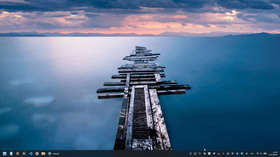

# Win11Seconds

**Bring back the seconds to your Windows 11 tray — on click.**

* [Why](#why)
* [Features](#features)
* [Usage](#usage)
* [Interaction](#interaction)
* [Troubleshooting](#troubleshooting)
* [Development](#dev)
* [Buy me a coffee](#buy-me-a-coffee)




## Why

In Windows 11, Microsoft removed a very simple but useful feature: clicking on the system clock in the tray no longer shows the clock with seconds ticking in real time. Nobody has any idea why they would do that (except, perhaps, their ignorance) but people really miss it:

* [Microsoft forum (1)](https://answers.microsoft.com/en-us/windows/forum/all/how-can-i-show-time-with-seconds-when-clicking-on/5702b0c4-8009-4332-80f8-b636a2279ab8)
* [Microsoft forum (2)](https://answers.microsoft.com/en-us/windows/forum/all/how-to-show-time-with-seconds-when-clicking-on-the/ceef59eb-cf30-4690-8615-9bf32cae40ec)
* [Reddit (1)](https://www.reddit.com/r/Windows11/comments/1bt6qs2/i_know_this_is_dumb_but_does_anyone_else_miss_the/)
* [Reddit (2)](https://www.reddit.com/r/Windows11/comments/1hrcj4i/i_just_want_a_clock_that_displays_seconds_that/)
* [Reddit (3)](https://www.reddit.com/r/Windows11/comments/1g3ps74/is_there_any_way_to_get_the_clock_with_seconds/)

Yes, there is [a way](https://www.elevenforum.com/t/turn-on-or-off-show-seconds-in-system-tray-clock-in-windows-11.10591/) to add seconds to the Windows clock right in the system tray (so you always see them, even without clicking), but as you can see from the discussions above, not everyone wants that — seconds are usually needed in a specific moment, not always. Plus, [it may be buggy](https://answers.microsoft.com/en-us/windows/forum/all/showing-seconds-on-clock-caused-problems-is-there/b2c5d253-8502-4707-80c5-46790702637c) or [resource-greedy](https://www.reddit.com/r/Windows11/comments/1gwk0yv/how_much_power_can_this_possibly_take_up/).

Hence, this simple utility brings back the ability to “click in tray and see seconds” to your Windows 11 — without bloating you with features you likely don’t need, which more advanced programs usually include.

## Features

- Extremely lightweight: **≈200 KB** single `.exe` file
- Minimal CPU & memory footprint: uses **8 MB of RAM** and nearly zero CPU while in the background
- Click the tray icon and see the `HH:mm:ss` ticking in real time
- Dark/light theme auto-detect
- Supports Windows transparency effects on supported Windows 11 builds
- Resizable, drag-to-move, double-click to maximize/unmaximize (looks like a full-screen clock, supports any aspect ratio display, even vertical)
- Remembers last position/size
- Optional always-on-top toggle in the context menu

## Usage

1. Download the latest build from [releases](https://github.com/alexchexes/Win11Seconds/releases):
   `Win11Seconds.exe` for regular x64 Windows, or `Win11Seconds-arm64.exe` for Windows on Arm.
   Direct links: [x64](https://github.com/alexchexes/Win11Seconds/releases/latest/download/Win11Seconds.exe), [ARM64](https://github.com/alexchexes/Win11Seconds/releases/latest/download/Win11Seconds-arm64.exe).
2. If you don't have [.NET Desktop Runtime 8](https://dotnet.microsoft.com/en-us/download/dotnet/8.0) installed, when you first run the downloaded .exe file, Windows will prompt you to download and install .NET Runtime from microsoft.com. Follow the link the Windows dialogue shows you to proceed, and complete the .NET installation. It's just 50 MB.
3. Open the downloaded `.exe`.
4. Sit tight. The icon appears in your Windows 11 tray in a second. Now you can... Click it to see the seconds!

> If you see the `Windows protected your PC` warning, that's okay (see the [Dev](#dev) section below to compile your own .exe if you don't trust this file). Just click **_More info_** > **_Run anyway_**.
> Or you can **_right-click the .exe_** > **_Properties (General)_** > **_Unblock_**.

Optionally, to make the program auto-start with Windows, add a shortcut to the file in one of these folders:
* `%userprofile%\AppData\Roaming\Microsoft\Windows\Start Menu\Programs\Startup` (Win+R → `shell:startup`) — for your user only
* `%ProgramData%\Microsoft\Windows\Start Menu\Programs\Startup` (Win+R → `shell:common startup`) — for all users

## Interaction

- **Left-click tray icon**: Show/hide popup clock (with seconds)
- **Double-click popup clock**: Maximize/Unmaximize
- **Esc when popup is fullscreen**: Exit fullscreen
- **Esc when popup is not fullscreen**: Hide it back to tray
- **Right-click tray icon or popup clock**: Show context menu, including always-on-top and transparency options
- **Hover over the top right corner of the popup clock**: Show "Close" button

## Troubleshooting

- If something doesn't work, make sure [.NET Desktop Runtime 8](https://dotnet.microsoft.com/en-us/download/dotnet/8.0) is installed and that your Windows 11 installation is up to date.
- If you have any problems, let me know [by creating issue](https://github.com/alexchexes/Win11Seconds/issues)

# Dev

- Install the [.NET SDK 8](https://dotnet.microsoft.com/en-us/download/dotnet/8.0)
- Open the repo root in VS Code or Visual Studio
- Main app project: `src/Win11Seconds/Win11Seconds.csproj`
- Test project: `tests/Win11Seconds.Tests/Win11Seconds.Tests.csproj`
- VS Code debug config is checked in under `.vscode/`
- Release version metadata for the `.exe` lives in `src/Win11Seconds/Win11Seconds.csproj` via `<Version>`

```powershell
# clone repo and navigate to it

# restore/build solution
dotnet build Win11Seconds.sln

# run the app from the project
dotnet run --project src/Win11Seconds/Win11Seconds.csproj

# run tests
dotnet test Win11Seconds.sln

# verify formatting/analyzers
dotnet format Win11Seconds.sln --verify-no-changes

# apply formatting fixes
dotnet format Win11Seconds.sln

# create Release build output
dotnet build src/Win11Seconds/Win11Seconds.csproj -c Release

# publish the single-file x64 .exe used for releases
dotnet publish src/Win11Seconds/Win11Seconds.csproj -c Release -r win-x64 --self-contained=false /p:PublishSingleFile=true

# publish the native ARM64 .exe for modern Windows on Arm devices
dotnet publish src/Win11Seconds/Win11Seconds.csproj -c Release -r win-arm64 --self-contained=false /p:PublishSingleFile=true

# make a release-friendly ARM filename copy
Copy-Item src/Win11Seconds/bin/Release/net8.0-windows/win-arm64/publish/Win11Seconds.exe src/Win11Seconds/bin/Release/net8.0-windows/win-arm64/publish/Win11Seconds-arm64.exe -Force
```

Debug build artifacts go to:

- `src/Win11Seconds/bin/Debug/net8.0-windows/`

Release build artifacts:

- `src/Win11Seconds/bin/Release/net8.0-windows/win-x64/`
- `src/Win11Seconds/bin/Release/net8.0-windows/win-arm64/`

Published single-file release artifacts:

- `src/Win11Seconds/bin/Release/net8.0-windows/win-x64/publish/`
- `src/Win11Seconds/bin/Release/net8.0-windows/win-arm64/publish/`

Notes:

- `dotnet build` and `dotnet test` already run Roslyn analyzers configured via `Directory.Build.props` and `.editorconfig`
- In VS Code, use `F5` or the `Launch Win11Seconds` configuration to debug the app
- The Release configuration disables debug symbols; Debug keeps them for stepping and breakpoints
- Before cutting a release, bump `<Version>` in `src/Win11Seconds/Win11Seconds.csproj`; the published `.exe` file version follows it automatically
- For GitHub releases, keep the asset names as `Win11Seconds.exe` for x64 and `Win11Seconds-arm64.exe` for ARM64 so the direct links above stay valid
- If you hit path or SDK issues in VS Code after installing .NET, fully restart VS Code, not just `Reload Window`

# Buy me a coffee?

<a href="https://ko-fi.com/alexchexes">
  
</a>

https://ko-fi.com/alexchexes
